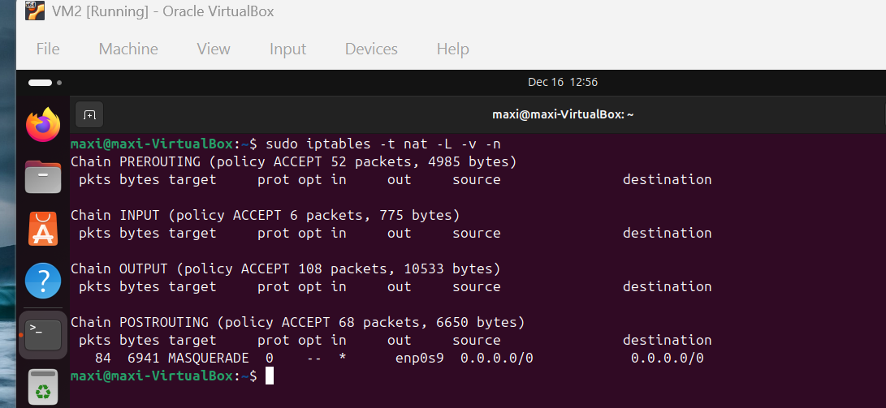
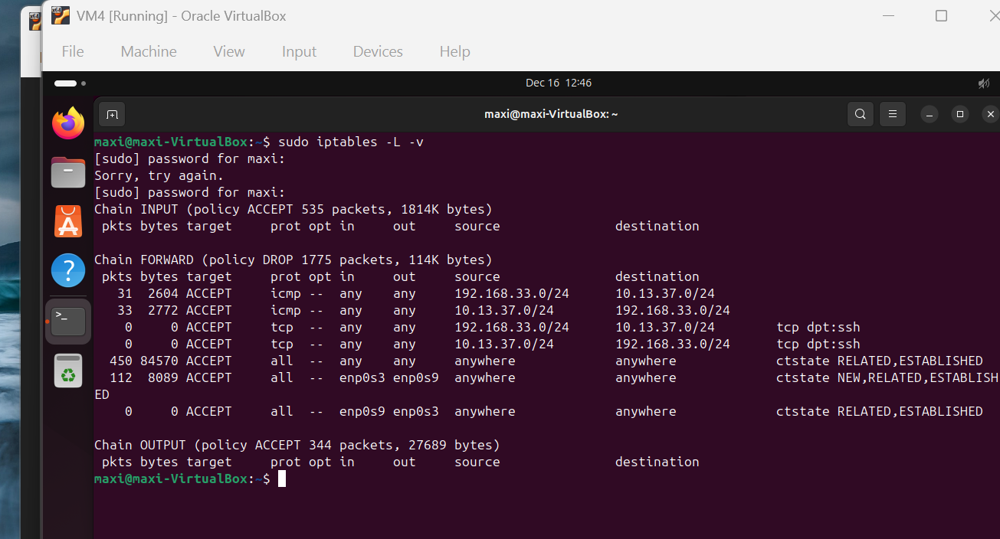

# Implementation
This document outlines how the lab was implemented at a high level.

## Enviroment Setup
- VirtualBox was used as the virtualization platform
- Four Linux VMs were created:
  - Two routers/firewalls
  - Two client machines
- Internal Networks and NAT adapters were configured per design

## Router Configuration 
Each router was configured to:
- Use static IP addresses
- Enable IP forwarding
- Run a DHCP server for its local network
- Maintain static routes to the remote subnet

## NAT Configuration
iptables was used to implement NAT on the WAN interface. Source NAT (MASQUERADE) allows internal clients to reach the Internet using the router’s WAN IP.

## Verification Steps
Verification focused on:
- Interface status and addressing
- Routing tables
- Internal and external connectivity

## Screenshots

### Router Interfaces

### NAT Configuration

### Routing Tables

### Firewall Configuration

